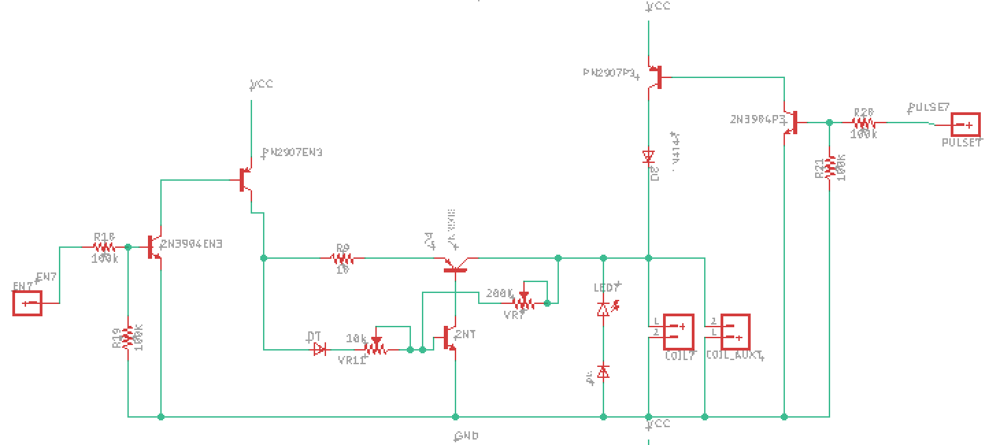

# pcb-designs
EAGLE PCB-DESIGN Files for Various Projects

+ 
+ Self-oscillating electromagnetic solenoid pendulums for kinetic art installation. 
 + this scalable circuit controls an array of solenoid electromagnets 
 + oscillatory motion using a a dynamic feedback control system. 
+ see documentation here: https://www.youtube.com/watch?v=IUg8T152WAE 

