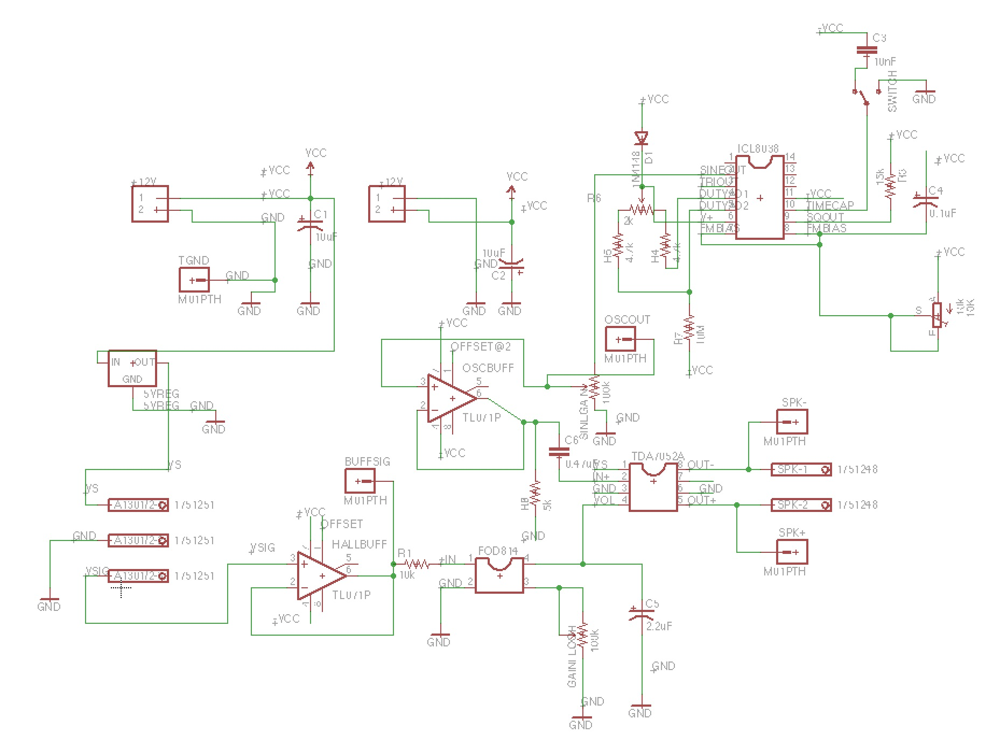
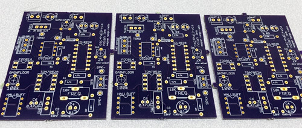

# pcb-designs
EAGLE PCB-DESIGN Files for Various Projects

 
Self-oscillating electromagnetic solenoid pendulums for kinetic art installation. 
+ this scalable circuit controls an array of solenoid electromagnets 
+ oscillatory motion using a a dynamic feedback control system. 
+ see audio-visual documentation [here](https://www.youtube.com/watch?v=IUg8T152WAE)

 

Magnetic Field -> Variable Frequency Oscillator and Voltage Controlled Amplifier design 
+ This circuit consists of 3 stages: a hall sensor + voltage buffer, sine wave oscillator + voltage buffer, and voltage controlled amplifier with variable signal power gain. 
+ video documentation [here](https://www.youtube.com/watch?v=2vKYp0yhHyw)

